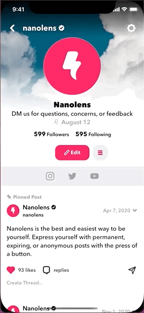
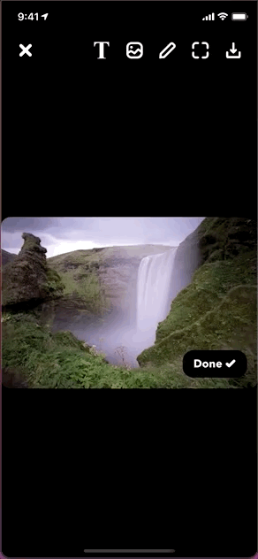

# NavigationTransitionController

[](https://travis-ci.org/HackShitUp/NavigationTransitionController)
[](https://cocoapods.org/pods/NavigationTransitionController)
[](https://cocoapods.org/pods/NavigationTransitionController)
[](https://cocoapods.org/pods/NavigationTransitionController)

## Purpose
```NavigationTransitionController``` is a UINavigationController subclass that makes it incredibly easy to perform 4 different interactive transition animations seen throughout popular iOS apps. It removes the layers of complexity required to conform to adopt [UIViewControllerTransitioningDelegate](https://developer.apple.com/documentation/uikit/uiviewcontrollertransitioningdelegate), [UIViewControllerInteractiveTransitioning](https://developer.apple.com/documentation/uikit/uiviewcontrollerinteractivetransitioning), and or [UIViewControllerAnimatedTransitioning](https://developer.apple.com/documentation/uikit/uiviewcontrolleranimatedtransitioning) per each view controller you're transitioning from and or to. 

Due to restrictions pertaining to the default animations applied to a navigation controller's ```UINavigationBar``` when performing push or pop operations for view controllers, we figured it's best to create a ```UINavigationController``` subclass that presents or dismisses view controllers that manages their own resepctive navigation bars.

A quick look at these documentations indicate degress of complexity that require significant amount of attention and detail for it to simply work. Below are example architectures of how one might implement an interactive transition animation when navigating _from_ a view controller _to_ another view controller.

[Advances in UIKit Animations and Transitions](https://developer.apple.com/videos/play/wwdc2016/216/)

## How It Works
The ```NavigationTransitionController``` works right out of the box. It's architected in such a way where all of its animations and managements are contained within this single class. 

A simple setup might look like this:
```swift
// MARK: - UIViewController
class FromViewController: UIViewController {
    // MARK: - View Controller Life Cycle
    override func viewDidLoad() {
        super.viewDidLoad()
        
        // MARK: - UIViewController
        let toVC = UIViewController()

        // MARK: - NavigationTransitionController
        let navigationTransitionController = NavigationTransitionController(rootViewController: toVC)
        navigationTransitionController.presentNavigation(self)
    }
}
```
The ```NavigationTransitionController``` supports 4 different types of view controller animations using the ```NavigationTransitionType``` enum. To specify the kind of animation to perform when presenting or dismissing view controllers, simply specify the animation type like so:
```swift
// MARK: - UIViewController
let toVC = UIViewController()

// MARK: - NavigationTransitionController
let navigationTransitionController = NavigationTransitionController(rootViewController: toVC, type: .presentation)
navigationTransitionController.presentNavigation(self)
```

## NavigationTransitionType
```swift
NavigationTransitionType.standard
```


```swift
NavigationTransitionType.presentation
```


```swift
NavigationTransitionType.fade
```


```swift
NavigationTransitionType.zoom
```


### Performing Zoom Animations
When performing the zoom animation, you must specify the ```initialView``` and ```finalView``` values when initializing the ```NavigationTransitionController```. For instance, the following provides an example of a view controller with a ```UIImageView``` IBOutlet. 
```swift
// MARK: - UIViewController
class FromViewController: UIViewController {
    
    // MARK: - IBOutlets
    @IBOutlet weak var imageView: UIImageView!
    
    // MARK: - View Controller Life Cycle
    override func viewDidLoad() {
        super.viewDidLoad()
        // MARK: - ImageViewController
        let imageVC = ImageViewController(image: UIImage(named: "YourRandomImage")!)

        // MARK: - NavigationTransitionController
        let navigationTransitionController = NavigationTransitionController(rootViewController: imageVC, type: .zoom, initialView: self.imageView)
        navigationTransitionController.presentNavigation(vc)
    }
}
```
During instances where you're scrolling a ```UIScrollView``` containing multiple photos or videos in a collection such as a ```UICollectionView```, you must also update the ```NavigationTransitionController```'s ```initialView``` and ```finalView```. Drawing from the previous example above:
```swift

// Assume this view controller is presenting the image-browser like the iOS Photos app.
class FromViewController: UIViewController, UICollectionViewDataSource, UICollectionViewDelegate, ImageViewControllerDelegate {

    // MARK: - ImageViewController
    fileprivate var imageVC: ImageViewController!

    // MARK: - UICollectionViewDelegate
    func collectionView(_ collectionView: UICollectionView, didSelectItemAt indexPath: IndexPath) {
        // MARK: - ImageViewController
        self.imageVC = ImageViewController()
        // MARK: - NavigationTransitionController
        let navigationTransitionController = NavigationTransitionController(rootViewController: self.imageVC, type: .zoom, initialView: collectionView.cellForItem(at: indexPath))
        navigationTransitionController.presentNavigation(self)
    }

    // MARK: - ImageViewControllerDelegate
    func imageViewControllerChangedImage(_ i: Int) {
        // MARK: - NavigationTransitionController
        // Here, we're updating the ImageViewController's NavigationTransitionController's initialView property whenever the user scrolls to a different image
        self.imageVC.navigationTransitionController?.updateInitialView(self.collectionView.cellForItem(at: indexPath))
    }
}
```
Then, in your ```ImageViewController``` class:
```swift
// Assume this view controller is a photo-browser like the iOS Photos app. Make sure to update this class' ```navigationTransitionController```'s ```finalView``` whenever the view changes.
class ImageViewController: UIViewController, UICollectionViewDataSource, UICollectionViewDelegate, UIScrollViewDelegate {
    // MARK: - ImageViewControllerDelegate
    var delegate: ImageViewControllerDelegate?
    
    // MARK: - IBOutlets
    @IBOutlet weak var collectionView: UICollectionView!
    
    // MARK: - UIScrollViewDelegate
    func scrollViewDidScroll(_ scrollView: UIScrollView) {
        // Get the current index that represents the index of a full-screen photo 
        let index = scrollView.contentOffset.x/scrollView.bounds.width
        
        // MARK: - UICollectionViewCell
        if let cell = collectionView.cellForItem(at: IndexPath(item: index, section: 0)) as? UICollectionViewCell {
            // MARK: - NavigationTransitionController
            // Update the NavigationTransitionController's ```finalView``` with the cell that's fully visible in the screen
            navigationTransitionController?.updateFinalView(cell)
        }
        
        // MARK: - ImageViewControllerDelegate
        // Call this class' delegate that takes an Int as its parameter
        self.delegate?.imageViewControllerChangedImage?(index)
    }
}
```

### Using the Interactive Transition Observer To Manage Gesture Interferences
When a ```NavigationTransitionController``` uses the ```NavigationTransitionType.presentation``` animation and its ```rootViewController``` contains scroll views that may conflict with this animation, you may utilize its closure to manage scroll states like so:
```swift
class ViewControllerWithScrollView: UIViewController {
    override viewDidLoad() {
        super.viewDidLoad()
        // MARK: - NavigationTransitionController
        navigationTransitionController?.interactiveTransitioningObserver = { (state: UIGestureRecognizer.State) in
            // Enable or disable the scroll views based on the UIGestureRecognizer.State
            self.collectionViews.forEach({$0.isScrollEnabled = (state == .began || state == .changed) ? false : true})
        }
    }
}
```
Regardless as to whether this is used, the transitions will still work because the ```NavigationTransitionController``` conforms to the ```UIGestureRecognizerDelegate``` .

## Dismissing the NavigationTransitionController
The ```NavigationTransitionController``` can be accessed via any ```UIViewController``` and to dismiss the view controller with the same animation you initialized it with, simply call the following:
```swift
@objc fileprivate func exitViewControllerWithAnimation(_ sender: Any) {
    // MARK: - NavigationTransitionController
    self.navigationTransitionController?.dismissNavigation()
}
```


## NavigationBar & NavigationBarItem
The ```NavigationBar``` and ```NavigationBarItem``` is an NSObject that manages the stylization of a view controller's ```UINavigationItem``` and a ```UIView``` subclass that's used to initialize the latter's navigation item's ```UIBarButtonItem``` values respectively. A simple use-case of this would look like the following:
```swift
class ViewController: UIViewController {
    
    // MARK: - NavigationBarItem
    var backItem, moreItem: NavigationBarItem!
    
    // MARK: - NavigationBar
    var navigationBar: NavigationBar!
    
    // MARK: - View Controller Life Cycle
    override func viewDidLoad() {
        super.viewDidLoad()
        // MARK: - NavigationBarItem
        backItem = NavigationBarItem(image: UIImage(named: "BackButton"), method: {
            // MARK: - NavigationTransitionController
            self.navigationTransitionController?.dismissNavigation()
        })
        
        // MARK: - NavigationBarItem
        moreItem = NavigationBarItem(image: UIImage(named: "OptionButton"), method: {
            // Do more
        })
        
        // MARK: - NavigationBar
        navigationBar = NavigationBar(viewController: self, titleAttributedString: NSAttributedString(string: "Title", attributes: [.foregroundColor: UIColor.black, .font: UIFont(name: "AvenirNext-Heavy", size: 16.0)!]), leftBarItems: [backItem], rightBarItems: [moreItem], titleLabelClosure: {
            self.collectionView.setContentOffset(.zero, animated: true)
        })
    }
}
```


## Example

To run the example project, clone the repo, and run `pod install` from the Example directory first.

## Requirements
- iOS 13

## Installation

NavigationTransitionController is available through [CocoaPods](https://cocoapods.org). To install
it, simply add the following line to your Podfile:

```ruby
pod 'NavigationTransitionController'
```

## Author

HackShitUp, josh@nanolens.co
Nanogram, Inc. nanolens@nanolens.co

## License

NavigationTransitionController is available under the MIT license. See the LICENSE file for more info.
